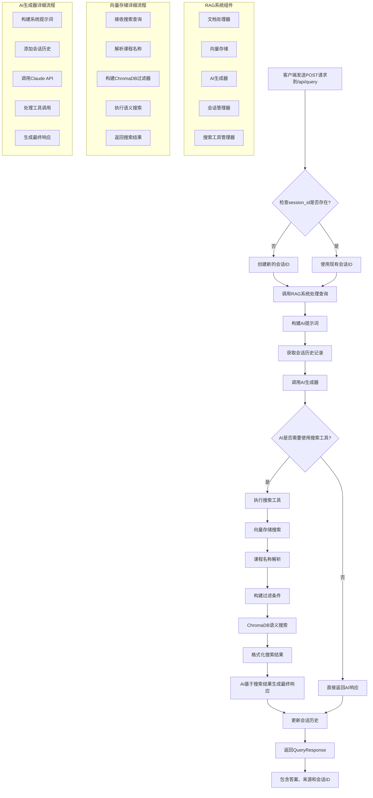

# /api/query 接口流程图

## 详细流程说明

### 1. 请求接收阶段
- 客户端发送POST请求到 `/api/query`
- 请求包含 `query`（用户问题）和可选的 `session_id`

### 2. 会话管理
- 如果没有提供 `session_id`，系统会创建一个新的会话
- 如果提供了 `session_id`，系统会使用现有会话

### 3. RAG系统处理
- 调用 `rag_system.query()` 方法
- 构建AI提示词
- 获取会话历史记录（如果存在）

### 4. AI生成器处理
- 调用 `ai_generator.generate_response()`
- 传递查询、会话历史和可用工具
- AI决定是否需要使用搜索工具

### 5. 搜索工具执行（如果需要）
- 如果AI决定需要搜索，会调用 `CourseSearchTool`
- 工具执行以下步骤：
  - 调用 `vector_store.search()`
  - 解析课程名称（如果提供）
  - 构建ChromaDB过滤条件
  - 执行语义搜索
  - 格式化搜索结果

### 6. 向量存储搜索详细流程
- **课程名称解析**：使用向量搜索找到最佳匹配的课程
- **过滤条件构建**：根据课程名称和课程编号构建ChromaDB过滤器
- **语义搜索**：在 `course_content` 集合中执行向量搜索
- **结果格式化**：将搜索结果格式化为可读文本

### 7. 最终响应生成
- AI基于搜索结果（如果有）生成最终响应
- 更新会话历史记录
- 返回包含答案、来源和会话ID的响应

### 8. 响应返回
- 返回 `QueryResponse` 对象
- 包含：
  - `answer`：AI生成的答案
  - `sources`：搜索结果的来源信息
  - `session_id`：会话标识符

## 关键组件说明

- **RAGSystem**：主要协调器，管理所有组件
- **VectorStore**：使用ChromaDB进行向量存储和搜索
- **AIGenerator**：与Claude API交互，生成响应
- **SessionManager**：管理对话会话和历史
- **ToolManager**：管理可用的搜索工具
- **CourseSearchTool**：具体的课程内容搜索工具
